# Autism Awareness Website 
[View website here](https://amandakoka.github.io/autismawareness/)
## Introduction 
The Autism awareness website is designed to be a responsive website allowing visitors to view on a range of devices from iPhone, tablet and desktop. It is an informative website in which users can use to learn about what autism is, the signs of autism and find support. This website is designed to inform users of autism. It contains information regarding autism ranging from the diagnosis, signs and symptoms, contact and support.The website is comprised of 3 pages, in which are accessible from the navigation menu (home page, signs page, contact us page). And a thank you page which can be seen after submitting your form on the contact page. 

## Table of Contents  

1. [User experience](#user-experience) 
   * [Project Goals](#project-goals) 
   * [User Stories](#user-stories) 
   * [Design Choices](#design-choices) 
   * [Wireframes](#wireframes)
2. [Features](#features)
   * [Accessibility](#accessibility) 
4. [Technologies used](#technologies-used)
   * [Languages used](#languages-used)
   * [Frameworks, Libaries and Programs Used](#frameworks,-libaries-and-programs-used)
5. [Testing](#testing)
   * [Bugs](#bugs)
   * [Testing User Stories](#testinguserstories)
   * [W3C validator](#w3cvalidator)
   * [Lighthouse](#lighthouse)
6. [Full testing](#fulltesting)    
7. [Deployment](#deployment)
   * [Local deployment](#localdeployment)
8. [Credits](#credits)

## User experience 
#### Project goals
The primary goal of the autism awareness website is to provide information and to educate users on autism. Its target audience is: students and parents with children(children with autism). 
#### Student goals 
Student goals are: 

* Easy navigation. 
* Clear information. 
* Videos and images related to content. 

The autism awareness website is a great way to meet these needs because: 

* Planning of the webiste and design process took these needs into account before starting to build. 
* A simple but effective navbar is used, in which a user can easily navigate to where is needed. 
* Information is layout in a clear structure in which users can easily read and understand. 
* Videos and images are all related to autism and even have the same colour scheme( which also goes with the theme of the website). 

#### Parent goals 
Parents goals are: 

* A visually appealing, informative website. 
* To be able to contact if needed. 
* The ability to find links to social medias. 

The autism awareness website is a great way to meet these needs because: 

* It has been designed with user experience as a priority. 
* There is a contact page which is easy to find. 
* All social media are linked in the footer consistenly on all pages. 

 ### User Stories  
 #### User goals: 

1. Be able to view the website on a range of device sizes(mobile, tablet, desktop)  
2. Make is easy for users to use and navigate to different pages to find information they need. 
3. To allow users the ability to contact to ask questions or with any messages they want to leave ect.. 

#### First time visitor goals: 

1. As a first time visitor, I want to easily understand the main purpose of the site and learn more about the Autism.
2. As a first time visitor, I want to be able to easily navigate throughout the site to find content and information I need.
3. As a first time visitor, I want to see the signs of autism, I also want to find links to social media, to see how trusted and known they are. 

#### Returning visitors: 

1. As a returning visitor, I want to check my knowledge on autism and find information about it.
2. As a returning visitor, I want to find ways to get in contact with any questions I may have.
3. As a returning visitor, I want to watch find the video I watched the first time visiting describing what autism is.

#### Frequent user goals:
  
1. As a frequent user, I want to check to see if any new information has been added or changed.
2. As a frequent user, I want to see if any more videos/images have been added that I can look at. 
3. As a frequent user, I want to see if there are any new links.

#### As a student, I want: 

1. To learn about autism. 
2. The ability to find and understand the information provided on the webiste. 
3. Use the information learnt in my work. 

## Design Choices  

### Colour Scheme/Images 

I first started looking at the colors I would use for my website. I decided blue because blue is the color that represents autism and blue is associated with trustworthiness, honesty, reliablity and is used a lot in the health sector which autism is a part of. However I then realized that I will be adding images and that they need to go well with the websites colour scheme so I started looking at the images I will include in my website then decide on the color scheme. 

I decided on the images from [freepix](https://www.freepik.com/author/vectorjuice)(credited in the credits section) and found a color scheme based on the images using [Canva](https://www.canva.com/colors/color-palette-generator/). I decided to stick with the blue theme still as it represents autism, but use the type of blue in the images (#4243E4). 

I then looked on the website [color hexa](https://www.colorhexa.com) for different shades and tints, and found #CBCCF8 a lighter tint to go together with the blue. I want to keep the colors clean and simple so the user can focus on the information and content but with it still looking appealing. 

 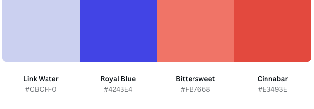 

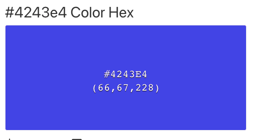  

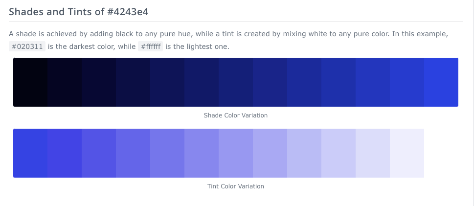 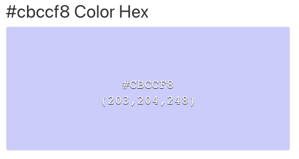 

### Imagery
All images have the same colours so they are consistent and appealing to the eye. Users wont get confused with different colours and the images are user friendly for all ages.

### Typography  

Google fonts was used for the fonts: 

* The Roboto font is the main font used throughout the whole website with Sans Serif as the fallback font in case for any reason the font isn't being imported into the site correctly. Roboto is a clean font which uses simplified characters that stand apart from each other and appear easier to read for users with dyslexia and visual impairment.
* Archivo used for headings which is a sans-serif font. 

### Wireframes  

* [Home page](documentation/homepagewireframe.png) 
* [Signs page](documentation/signspagewireframe.png) 
* [Contact us page](documentation/contactuswireframe.png) 

## Features
The website is comprised of 3 pages, in which are accessible from the navigation menu (home page, signs page, contact us page).

#### All pages on website have:
A responsive navigation bar, at the top of the page under the heading, which allows the user to navigate through the site. The navigation bar consists of links to each page and lines vertically when in mobile view. A footer which contains links to social media account such as Facebook, Twitter, YouTube and Instagram.

#### Home page:
What is autism section- explains what autism is with an image to the right of the text. Information on how many people have autism with a YouTube video (what is autism) to the right of the text. 

#### Signs page: 
Signs in children and adults with a picture in the middle. Signs of autism in girls' section – text explaining autism in girls with an image to the right.

#### Contact us page: 
Form that contains name, email address and ‘your message’ section for the user to write what they would like to contact about. The user submits this by using the submit button. Users must fill in the name, email and message area to submit if they don’t a tooltip guides users to fill in sections they have missed. Once you submit, the user will be taken to a thank you page which has a message saying thankyou for contacting us!!

#### Thank you page:
Has a comment saying thankyou for contacting and a sentence saying we will be back in touch soon. And an image beneath tying all the images used on the website together. 

### Accessibility  

I have been mindful during the coding to ensure that the website is as accessible friendly as possible. I have achieved this by:

* Using semantic HTML
* Using descriptive alt attributes on images on the site
* Ensuring that there is a sufficient colour contrast throughout the site.
* Ensuring menus are accessible and easy to find by marking the current page with a line 
 underneath the title.

### Fonts 

Roboto and archivo pair well together. Roboto uses simplified characters which stand apart from each other and appear easier to read for users with dyslexia and visual impairment. 

### Colour Scheme  

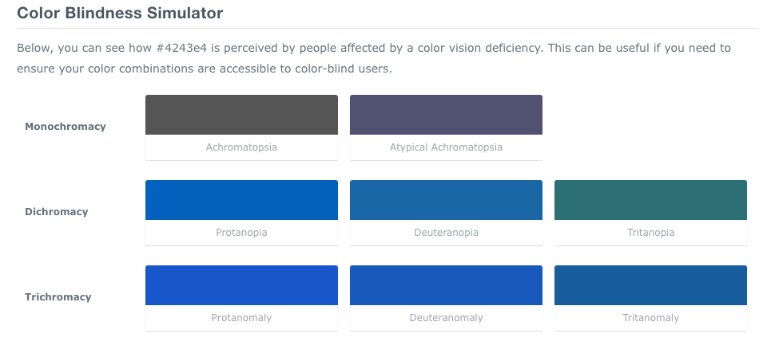 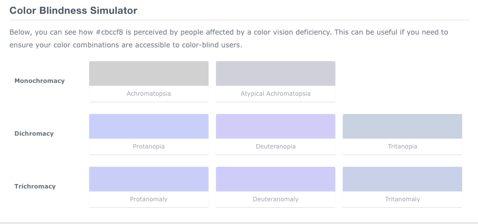

## Technologies Used
### Languages used 
* [HTML5](https://en.wikipedia.org/wiki/HTML5)
* [CSS](https://en.wikipedia.org/wiki/Cascading_Style_Sheets)

### Frameworks, Libraries & Programs Used

1. [Google fonts](https://fonts.google.com/) was used to import roboto and archivo font into style.css file which is used on all pages throughout the project.
2. [Font awesome](https://fontawesome.com/) was used on all pages throughout the website to add icons to footer links for aesthetic and UX purposes.
3. [Hover.css](https://ianlunn.github.io/Hover/) was used on the navbar menu so when you hover over on one of the items a line appears underneath.
4. [Git](https://git-scm.com/) is used for version control by utilizing the Gitpod terminal to commit to Git and Push to GitHub.
5. [Github](https://github.com) is used to store the projects code after being pushed from Git.
6. [Figma](https://www.figma.com/) was to create the wireframes during the design process.
7. [Compress png](https://compresspng.com/) to compress images.
8. [Retoucher](https://retoucher.online/) to remove background of images.

## Testing
Testing was ongoing throughout the entire build of the webiste. I utilised Chrome Developer tools while building to pinpoint and troubleshoot any issues as I went along.

### Bugs

#### First project meeting with my mentor:
1. My images were wider than the rest of my main content while on mobile view
   * I solved this by removing the background of the images and reducing the size so it would fit better on different screen sizes.
     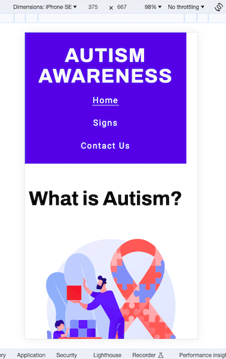
2. My tiles and content were not alligned on larger screens, so I alligned and styled all headings and content consistent throughout the website.
3. On larger screens my footer, floated a little up the page with a bar below. I solved this by removing the height style in my media query.
4. There was too much text and content, so I cut down the amount of information throughout the webiste.

#### Whilst coding
* My footer seemed to slide to the left, so I inspected this and found the problem and resolved it by adding space above the footer so the image wasn't obstructing or in the way of the footer.
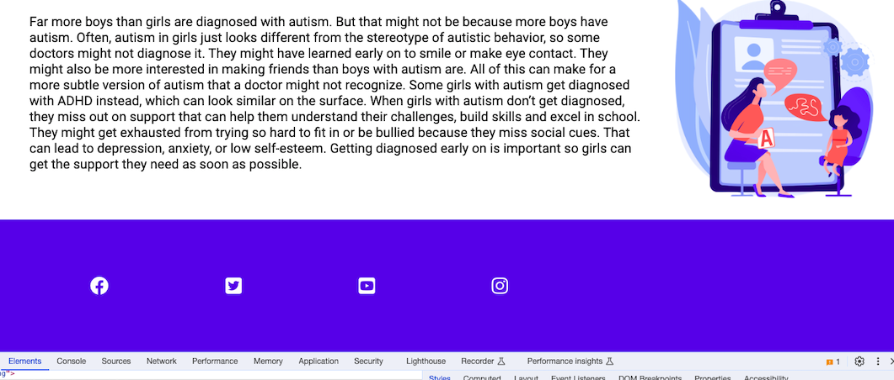 

#### Mid project meeting with my mentor:
1. On my contact page, when clicking the submit button, it wasnt being redirected to the thankyou.html page. I Solved this by adding the method and action to the form.
2. On certain sizes, there were issues with my page 2 top section. I fixed this by adding css media query.
   * 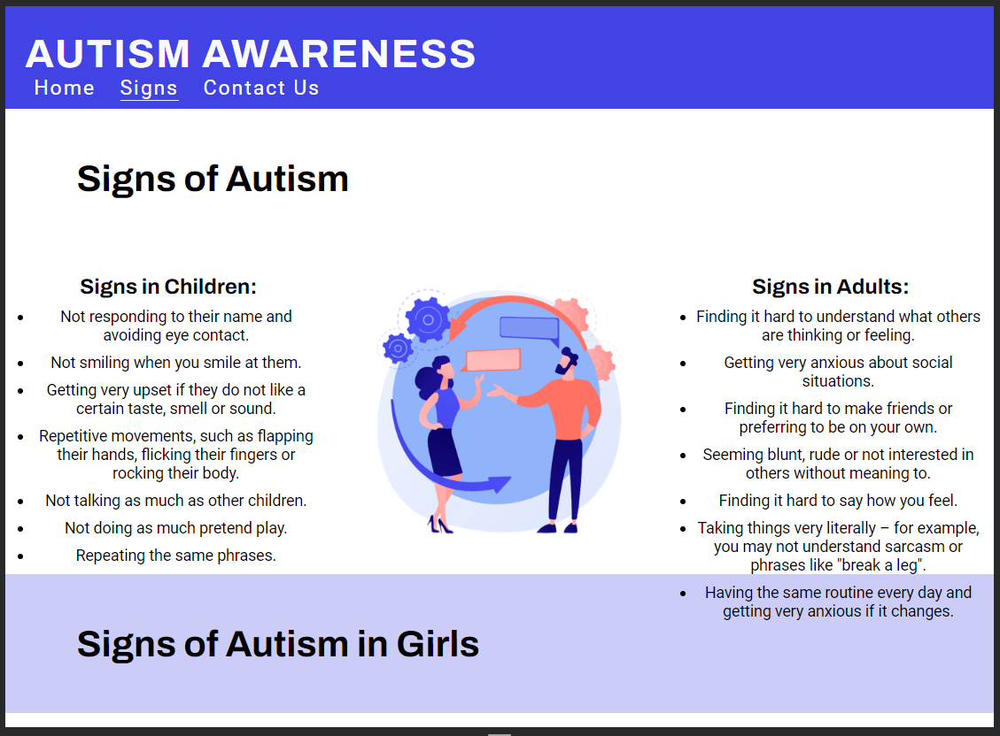
3. The bottom section of the second page was different to the first, so it was recommended to maybe try keep the consistency so I decided to keep them consistent.
   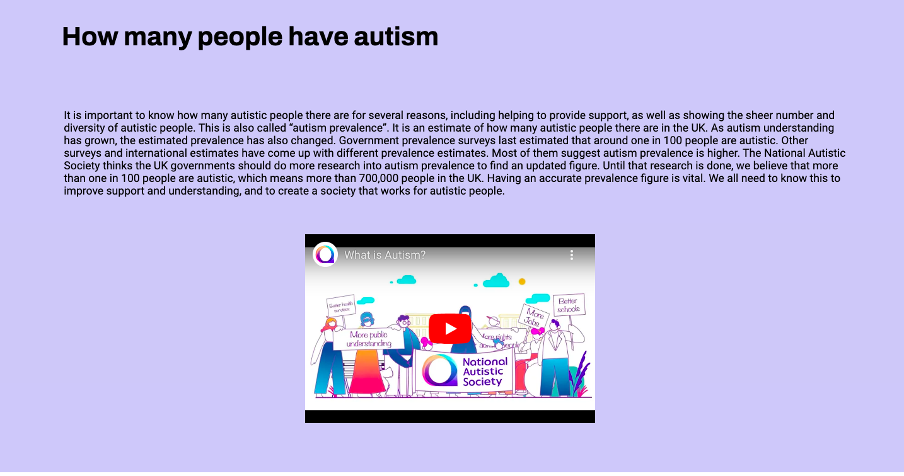
   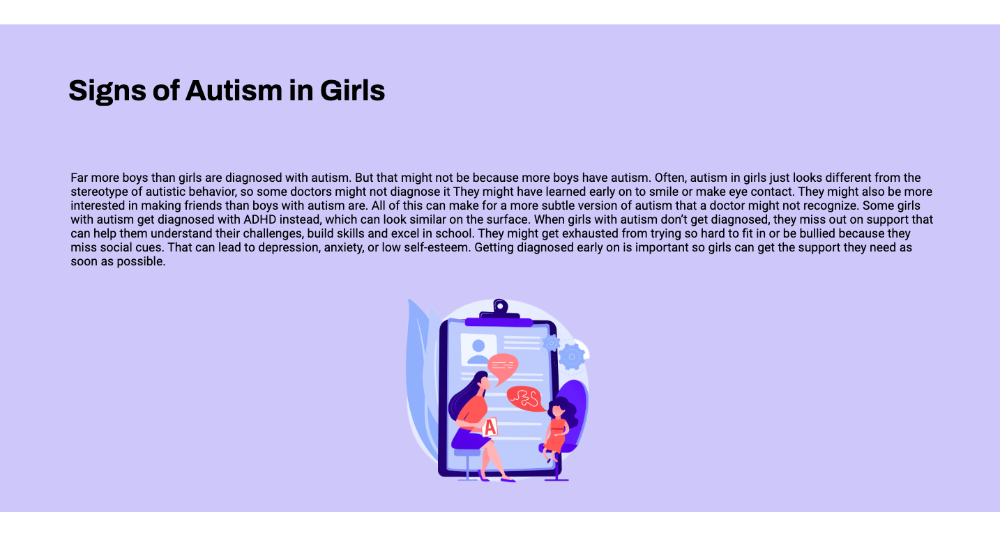
   
#### Whilst coding
* My contact and thankyou page were distorted when in tablet view and not filling the view properly. I fixed this by adding media query for tablet view and adding different styles.
  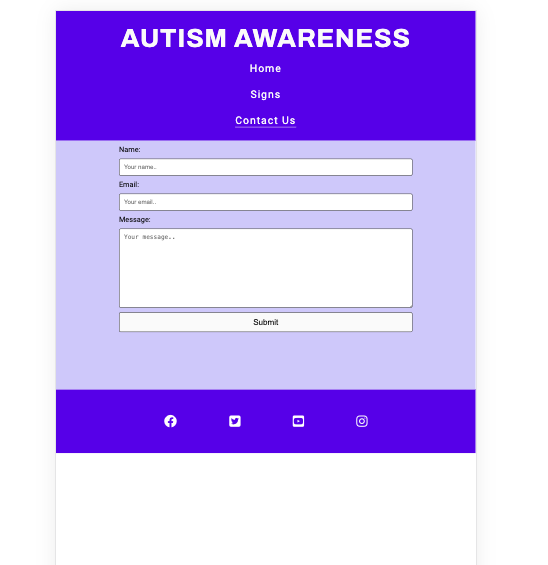
* Whilst checking different devices on chrome tools I found that on galaxy fold the logo is too big and goes off the page.
  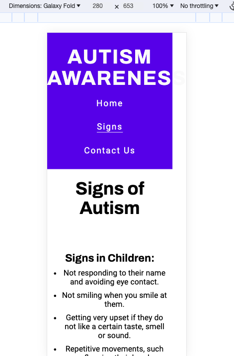
    
### Testing User Stories 
* First time visitors  

  * I want to easily understand the main purpose of the site and learn more about the Autism. Straight away on the home page a user 
  knows what the website is and explains about autism.
  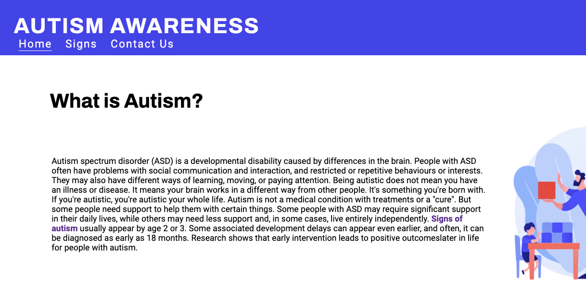

  * I want to be able to easily navigate throughout the site to find content and information I need. All site navigation is in the top 
  navigation bar which is consistent throughout all pages on the site.
  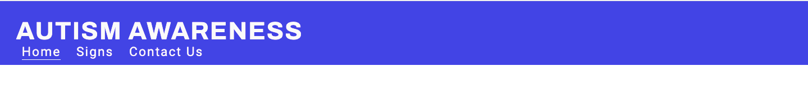
  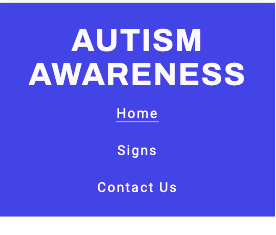

  * I want to see the signs of autism, I also want to find links to social media, to see how trusted and known they are. Easy to find 
  signs page in navigation bar with information on signs. Footer consisting of social medias at the bottom of each page throughout the 
  website.
  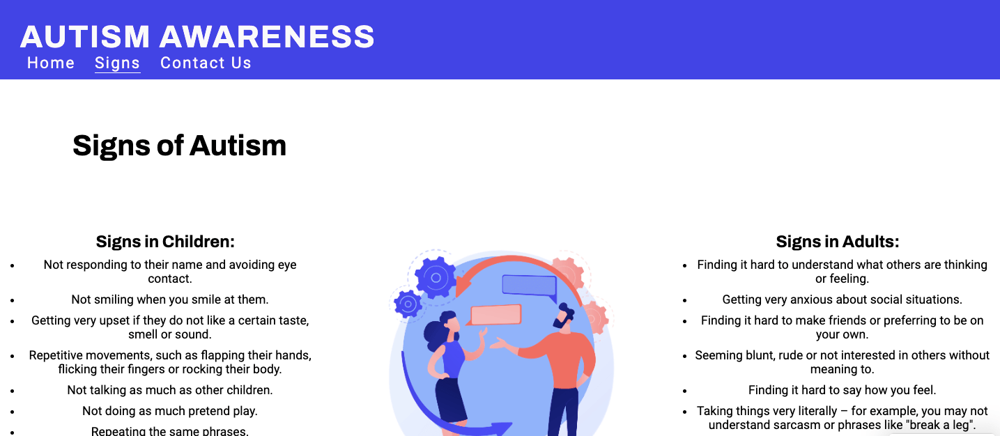
  

* Returning visitors  

  * I want to check my knowledge on autism and find information about it. All information is up to date and easy to understand, users 
  can visit the website again and find the information they need. 

  * I want to find ways to get in contact with any questions I may have. Contact page is easily navigated and allows users to send 
  their message.
  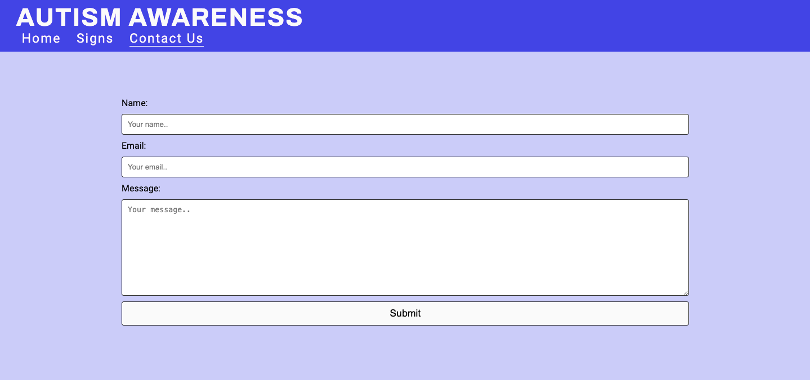

  * I want to watch find the video I watched the first time visiting describing what autism is.
  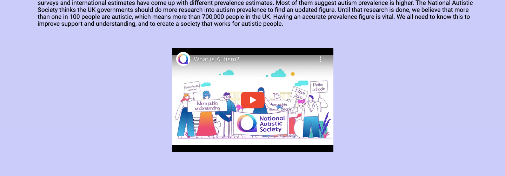

### W3C Validator 
The W3C validator was used to validate the HTML on all pages of the website and the CSS in style.css file.
* [Index page html](documentation/hpvalidatorr.png)
* [Signs page html](documentation/signsvalidator.png)
* [Contact us page html](documentation/contactvalidator.png)
* [Thank you page html](documentation/thankyouvalidator.png)
* [Style.css CSS](documentation/cssvalidator.png)

### Lighthouse
I used Lighthouse chrome developer tools to test the performance, accessibility, best practices and SEO of the website. It was suggested to add meta description and aria label to my footers icons on each page, so I did this then tested again.

## Full testing 
To fully test the webiste, I performed the following testing on browsers(Google Chrome, Safari and Firefox) and on devices(MacBook Air 13 inch, Iphone 11, Iphone12, Iphone12 mini, Ipad 7th generation). I also went through each page using google chrome developer tools to ensure the responsiveness on different screen sizes. 

## Google Chrome
#### Links
* Macbook air:
* Iphone 11:
* Iphone 12:
* Iphone 12 mini:
* Ipad:
#### Text Content
* Macbook air:
* Iphone 11:
* Iphone 12:
* Iphone 12 mini:
* Ipad:
#### Media Content
* Macbook air:
* Iphone 11:
* Iphone 12:
* Iphone 12 mini:
* Ipad:
#### Contact Us Page
* Macbook air:
* Iphone 11:
* Iphone 12:
* Iphone 12 mini:
* Ipad:

## Safari
#### Links
* Macbook air:
* Iphone 11:
* Iphone 12:
* Iphone 12 mini:
* Ipad:
#### Text Content
* Macbook air:
* Iphone 11:
* Iphone 12:
* Iphone 12 mini:
* Ipad:
#### Media Content
* Macbook air:
* Iphone 11:
* Iphone 12:
* Iphone 12 mini:
* Ipad:
#### Contact Us Page
* Macbook air:
* Iphone 11:
* Iphone 12:
* Iphone 12 mini:
* Ipad:

## Firefox
#### Links
* Macbook air:
* Iphone 11:
* Iphone 12:
* Iphone 12 mini:
* Ipad:
#### Text Content
* Macbook air:
* Iphone 11:
* Iphone 12:
* Iphone 12 mini:
* Ipad:
#### Media Content
* Macbook air:
* Iphone 11:
* Iphone 12:
* Iphone 12 mini:
* Ipad:
#### Contact Us Page
* Macbook air:
* Iphone 11:
* Iphone 12:
* Iphone 12 mini:
* Ipad:

## Deployment 
GitHub was used to deploy the live website. To do this you need to:
1. Log in or signup to Github.
2. Find the repository for this website, autismawareness.
3. Click on the settings link.
4. Click on the pages link in the left hand side navigation bar.
5. In the source section select deploy from a branch.
6. Below this in the branch section, select main from the menu and root from the folder menu.
7. Click save and your live Github pages site is deployed in the URL shown.

### Local Deployment
#### How to Fork
To fork the autismawareness site:
1. Log in or signup to Github.
2. Find the repository for this website, autismawareness.
3. Click the fork button in the top right corner.
#### How to Clone
To clone:
1. Log in or signup to Github.
2. Find the repository for this website, autismawareness.
3. Click on the code button and select whether you would like to clone with HTTPS,SSH or Github CLI and copy the link shown.
4. Open the terminal in your code editor and change the current working directory to the location you want to use for the cloned directory.
5. Type 'git clone' into the terminal, then paste the link you copied in step 3. Press enter.

## Credits

### Content and Media
1. All images came from [freepik by vectorjuice](https://www.freepik.com/author/vectorjuice)
2. The video used in the webiste is from [youtube by the national autistic society](https://www.youtube.com/watch?v=Lk4qs8jGN4U) 
3. Information and facts on home page used from [here](https://www.autism.org.uk/advice-and-guidance/what-is-autism) 
4. Information and facts on signs page used from[here](https://www.nhs.uk/conditions/autism/signs)
5. Information and facts on autism in girls section from[here](https://childmind.org/article/autistic-girls-overlooked-undiagnosed-autism/)

### Code
1. CSS code for footer used from code institutes love running project and edited for my website. 
2. CSS code for contact page form was taken from this [website](https://stjepanmesaros.github.io/portfolio-project-one-anxiety/contact.html) and edited to fit my websites needs.
3. W3Schools being resource for information if needed. 

### Acknowledgements 